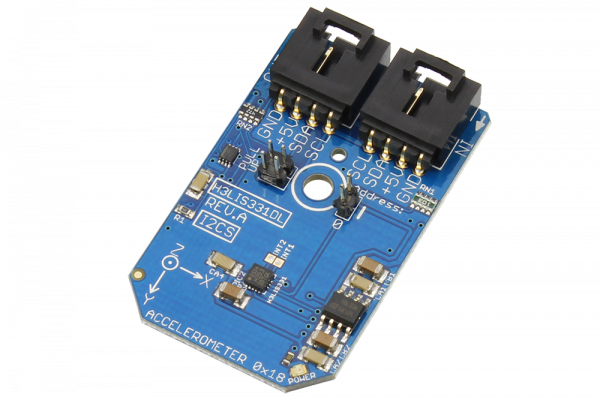

[](https://store.ncd.io/product/h3lis331dl-3-axis-linear-accelerometer-i%C2%B2c-mini-module/cf).

# H3LIS331DL

The H3LIS331DL, manufactured by STMicroelectronics, is a low-power high performance 3-axis linear accelerometer belonging to the “nano” family, with digital I2C serial interface. The H3LIS331DL has dynamically user selectable full scales of ±100g/±200g/±400g and it is capable of measuring accelerations with output data rates from 0.5 Hz to 1 kHz.
This Device is available from www.ncd.io

[SKU: H3LIS331DL]

(https://store.ncd.io/product/h3lis331dl-3-axis-linear-accelerometer-i%C2%B2c-mini-module/)
This Sample code can be used with Raspberry Pi.

Hardware needed to interface H3LIS331DL 3Axis Accelometer With Raspberry Pi :

1. <a href="https://store.ncd.io/product/h3lis331dl-3-axis-linear-accelerometer-i%C2%B2c-mini-module/">H3LIS331DL 3Axis Accelometer Sensor</a>

2. <a href="https://store.ncd.io/product/i2c-shield-for-raspberry-pi-3-pi2-with-outward-facing-i2c-port-terminates-over-hdmi-port/">Raspberry Pi I2C Shield</a>

3. <a href="https://store.ncd.io/product/i%C2%B2c-cable/">I2C Cable</a>

## Python

Download and install smbus library on Raspberry pi. Steps to install smbus are provided at:

https://pypi.python.org/pypi/smbus-cffi/0.5.1

Download (or git pull) the code in pi. Run the program.

```cpp
$> python H3LIS331DL.py
```
The lib is a sample library, you will need to calibrate the sensor according to your application requirement.
